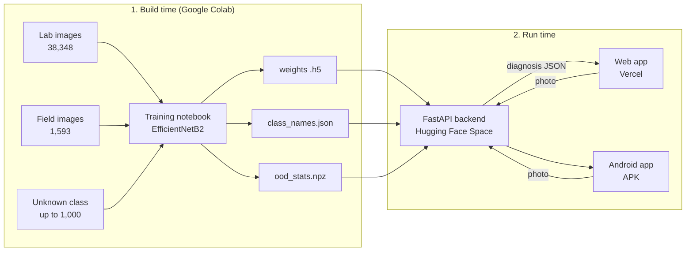
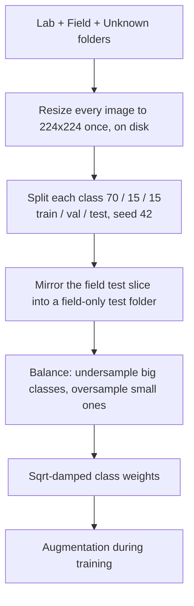
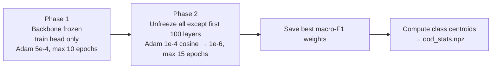
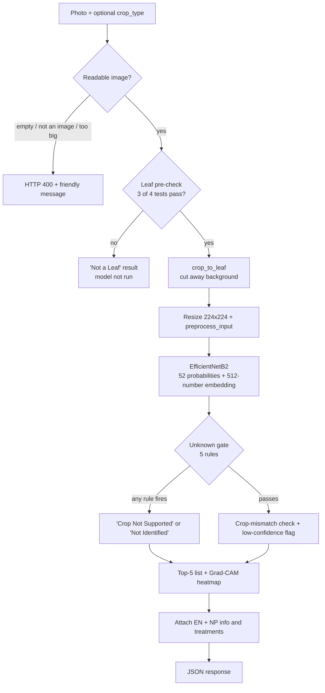
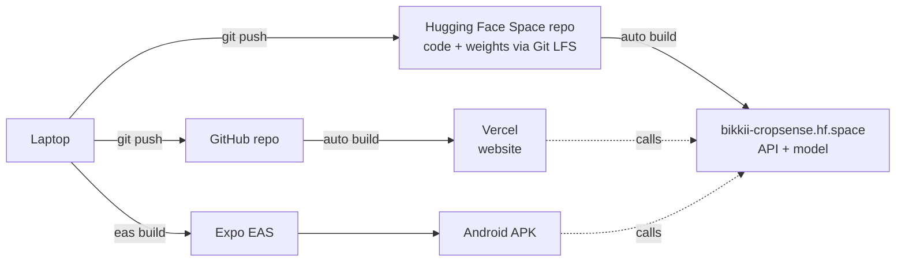

# CropSense AI — The Complete Workflow, A to Z

A study guide for the defense. It follows the project in the order it was built
and the order a photo travels through it:

**problem → data → training → model files → backend → web app → mobile app →
deployment → testing & results → limitations → questions.**

Every number here comes from the code, the model files or the final report
(`CropSense_Final_Report.pdf`). Where a number belongs to an older run and not
the deployed model, it says so.

---

## Contents

- [A. The problem and the idea](#a-the-problem-and-the-idea)
- [B. What the system does, in one picture](#b-what-the-system-does-in-one-picture)
- [C. The 10 crops and 52 classes](#c-the-10-crops-and-52-classes)
- [D. The data](#d-the-data)
- [E. Preparing the data for training](#e-preparing-the-data-for-training)
- [F. The model: EfficientNetB2](#f-the-model-efficientnetb2)
- [G. Training, step by step](#g-training-step-by-step)
- [H. After training: the three files that travel together](#h-after-training-the-three-files-that-travel-together)
- [I. Model iterations (how we got here)](#i-model-iterations-how-we-got-here)
- [J. The backend: what happens when a photo arrives](#j-the-backend-what-happens-when-a-photo-arrives)
- [K. Teaching the model to say "I don't know"](#k-teaching-the-model-to-say-i-dont-know)
- [L. Grad-CAM: showing where the model looked](#l-grad-cam-showing-where-the-model-looked)
- [M. The knowledge base: symptoms and treatments in two languages](#m-the-knowledge-base-symptoms-and-treatments-in-two-languages)
- [N. The API response](#n-the-api-response)
- [O. The web app](#o-the-web-app)
- [P. From response to screen: confidence bands](#p-from-response-to-screen-confidence-bands)
- [Q. History and feedback](#q-history-and-feedback)
- [R. The mobile app](#r-the-mobile-app)
- [S. Accounts and the database](#s-accounts-and-the-database)
- [T. Deployment](#t-deployment)
- [U. Testing](#u-testing)
- [V. Results: how good is it really?](#v-results-how-good-is-it-really)
- [W. Performance (speed)](#w-performance-speed)
- [X. Limitations: say these before you are asked](#x-limitations-say-these-before-you-are-asked)
- [Y. Future work](#y-future-work)
- [Z. Defense questions and answers](#z-defense-questions-and-answers)
- [Cheat sheet: numbers to remember](#cheat-sheet-numbers-to-remember)

---

## A. The problem and the idea

**The problem.**
- Plant diseases destroy a large share of staple crops every year.
- Smallholder farmers in Nepal often can't reach an agriculture expert in time,
  and most tools are in English only.
- Research models report 98–99% accuracy on clean lab photos, but three things
  hold them back:
  - they rarely become tools farmers can actually use
  - they don't explain their answers
  - they fail on real field photos and on crops they were never trained on

**The idea.** A farmer takes a photo of one leaf, on a phone or in a browser. The
system answers three questions:
1. **What is probably wrong?** A possible disease, never a confirmed diagnosis.
2. **How sure is it?** High, Moderate or Uncertain.
3. **What should I do?** Symptoms, cause, prevention and treatment, in **English
   or Nepali**.

It also shows **where** on the leaf the model looked (Grad-CAM), and it says
**"I don't know"** instead of guessing when the photo is unclear or the crop isn't
supported.

**Design principles to repeat in the defense:**
- **Decision support, not an oracle.** Every result is a *possible* match, with a
  disclaimer to confirm with an agrovet.
- **Honest about doubt.** Unclear results are shown as Uncertain, never dressed up
  as High.
- **Free and bilingual.** No payment, English and Nepali throughout. An account
  is required so that a farmer's checks follow them to any device — the honest
  cost is a sign-up step before the first photo.

---

## B. What the system does, in one picture



**Three parts, one brain.** The website and the mobile app contain **no AI**.
Both send the photo to the same `POST /predict` endpoint and get back the same
JSON. Changing a threshold in the backend changes both apps at once.

---

## C. The 10 crops and 52 classes

| Crop | Classes | Conditions |
|---|---|---|
| Apple | 4 | Black Rot, Cedar Rust, Scab, Healthy |
| Banana | 7 | Black Sigatoka, Yellow Sigatoka, Bract Mosaic Virus, Insect Pest, Moko, Panama, Healthy |
| Citrus | 3 | Canker, Greening, Healthy |
| Cucumber | 3 | Downy Mildew, Powdery Mildew, Healthy |
| Grape | 4 | Black Measles, Black Rot, Leaf Blight, Healthy |
| Maize | 3 | Common Rust, Northern Leaf Blight, Healthy |
| Mango | 8 | Anthracnose, Bacterial Canker, Cutting Weevil, Die Back, Gall Midge, Powdery Mildew, Sooty Mould, Healthy |
| Potato | 3 | Early Blight, Late Blight, Healthy |
| Rice | 6 | Bacterial Leaf Blight, Brown Spot, Leaf Blast, Leaf Scald, Leaf Smut, Narrow Brown Spot |
| Tomato | 10 | Bacterial Spot, Early Blight, Late Blight, Leaf Mold, Mosaic Virus, Septoria Leaf Spot, Spider Mites, Target Spot, Yellow Leaf Curl Virus, Healthy |
| *(catch-all)* | 1 | `Unknown___Unknown` |

- **51 real classes + 1 Unknown = 52 model outputs.**
- Rice is the only crop with no Healthy class.
- Labels follow the pattern `Crop__Disease` (e.g. `Potato__Late_Blight`). The
  backend builds the "supported crops" list by splitting on `__`, so that list
  always matches what the model was really trained on.

---

## D. The data

Three data sources, each with a different job:

| Dataset | Images | What it looks like | Its job |
|---|---|---|---|
| **Lab** (`Dataset.zip`) | 38,348 in 51 classes | One leaf, plain background, controlled light | Teach what each disease looks like |
| **Field** (`field_data/`) | 1,593 in 51 classes (10–64 per class) | Real photos: clutter, shadows, many leaves | Close the lab → field gap |
| **Unknown** | up to 1,000 | Leaves of other crops, random photos, some synthetic | Teach the model to decline |
| **PlantDoc test** (external) | 236 → 226 after de-duplication | Real field photos from another project | Independent evaluation only, never trained on |

### D.1 Lab data
- PlantVillage-style images for apple, grape, maize, potato and tomato, plus other
  public collections for banana, citrus, cucumber, mango and rice.
- **Severely imbalanced:** Maize Common Rust has **2,384** images, Banana Yellow
  Sigatoka only **23**, a ratio of about **103 : 1**.
- That's why the project checkpoints on **macro-F1**, not accuracy (explained in G).

### D.2 Field data: built with five scripts in `scripts/`
1. **`download_field_images.py`:** searches Bing Images with a hand-written query per
   class (e.g. "rice bacterial leaf blight field").
2. **`clean_field_images.py`:** removes only objective junk, never relabels:
   - corrupt files
   - images under 224 px on the short side
   - **274 near-duplicates**, found with an 8×8 average hash at Hamming distance ≤ 4
3. **`delete_collisions.py`:** the same picture in two class folders means one label
   is wrong, so **every copy is deleted** (43 collisions).
4. **`build_montages.py` + `apply_visual_deletions.py`:** each class becomes a
   numbered contact sheet. A human reviews it and says "delete tiles 3, 7, 12", and
   the script maps those back to filenames. This is the **manual label check**.
5. **`redownload_thin.py`:** refills classes that became too small. It uses Latin
   pathogen names in queries to avoid look-alikes.

Every deletion is logged (`scripts/clean_field_report.txt`).

### D.3 The Unknown class (`Unknown___Unknown`)
- Up to **700 real leaves of crops the model doesn't cover** (guava, papaya,
  coffee…). These do the real work: a guava leaf *looks like a leaf*, and only real
  non-target leaves teach where the boundary is.
- About **200 random real-world photos**.
- **Synthetic noise and leaf-like textures, capped at 35%**. They cover junk inputs
  (blur, a photo of nothing), not untrained crops.

---

## E. Preparing the data for training



**Splitting.**
- Lab and field images are split **separately**, 70/15/15 per class with seed 42,
  then merged, so every class learns from both kinds of photo.
- The field test slice is also copied into a **field-only test folder**.
- Classes with fewer than 20 field images (3 classes) put all their field images
  into training.

**Balancing, in three deliberately gentle layers:**
1. **Resampling.** Big classes are undersampled to **2.0× the median** class size.
   Small classes are oversampled to **1.2× the median**, but never more than 5×
   their real images, because repeating one photo too often teaches memorisation.
   The largest-to-smallest ratio drops from 103:1 to about 2:1.
2. **Protected images.** Undersampling deletes files, but real field photos
   (`field_` prefix) and real non-target leaves (`leaf_` prefix) are **never
   deleted**, because they are the rarest and most valuable. Synthetic filler goes
   first.
3. **Sqrt-damped class weights:** `w = sqrt(mean_count / n_class)`, which lands
   around 1.0–1.5. An earlier scheme (`max/n`, weights 1–6) stacked on top of
   resampling over-corrected and made training unstable.

**Augmentation**, applied randomly on each training pass:
- **Standard:** rotation ±40°, shift 0.25, shear 0.2, zoom 0.3, brightness 0.6–1.4,
  channel shift 30, horizontal flip, reflect fill.
- **Vertical flip is off,** because leaves have a natural tip-to-stalk direction.
- **Custom `field_augment`** makes clean lab photos look like phone photos:

| Transform | Probability | Settings | Simulates |
|---|---|---|---|
| Gaussian blur | 0.35 | kernel 3 or 5 | Out-of-focus or shaky photo |
| Gaussian noise | 0.30 | σ 4–14 | Sensor noise in low light |
| Directional shadow | 0.30 | strength 0.5–0.85 | Sun angle, the photographer's shadow |

**Why resize on disk first?** Decoding a 4000×3000 phone photo costs more CPU than
the GPU spends on the forward pass. Doing it once saves that cost every epoch.

---

## F. The model: EfficientNetB2

**Transfer learning.** Start from a network already trained on ImageNet (1.2
million general images), which already knows edges, textures and shapes. Then
teach it the leaf diseases.

```
Input 224 × 224 × 3
  → EfficientNetB2 backbone (ImageNet weights, no top)     7,768,569 params
  → GlobalAveragePooling2D
  → Dropout(0.5)
  → Dense(512, ReLU, L2 1e-4)   name = "dense_hidden"      ← used for "unknown" check
  → Dropout(0.5)
  → Dense(52, softmax, L2 1e-4, float32)  name = "dense_output"
Total ≈ 8.5 million parameters
```

**Two details worth knowing:**
- **`dense_hidden` is named on purpose:** the unknown-crop check reads its 512
  numbers (the "embedding") at prediction time.
- **`dense_output` is forced to float32:** training uses mixed precision (float16
  for speed), and softmax in float16 is numerically unstable.

**Why EfficientNetB2?**
- **Accuracy per parameter:** about 8.5 M parameters versus 138 M for VGG16.
- It **trains on a free Colab T4 GPU and runs on a free CPU server**.
- **Compound scaling** grows depth, width and resolution together.
- **B3 (300×300) was tried first** and dropped: more compute and memory for little
  gain.
- **MobileNetV2 was also tried** as a baseline.

**Preprocessing (must be identical everywhere):**
- Resize to 224×224, then EfficientNet's own `preprocess_input` on **raw 0–255
  pixels**. There is **no** manual `/255`, because that's a classic silent accuracy
  killer.
- The same function runs in the notebook, `backend/main.py` and
  `backend/predict_test.py`.

---

## G. Training, step by step

Notebook: `scripts/train_colab_google.ipynb`, on Google Colab (T4 GPU), with data
and checkpoints on Google Drive.



**Why two phases?**
- The new head starts with **random weights**. If you unfreeze the backbone
  immediately, those random gradients wreck the ImageNet features you wanted to keep.
- **Phase 1** trains only the head: **748,084 trainable params**, learning rate 5e-4.
- **Phase 2** unfreezes the backbone except the first 100 layers, which hold generic
  edge and texture filters. It fine-tunes at a **100× smaller learning rate**.

| Setting | Phase 1 | Phase 2 | Why |
|---|---|---|---|
| Trainable | Head only | All but first 100 backbone layers | Keep generic early filters |
| Optimiser / LR | Adam 5e-4 (ReduceLROnPlateau ×0.5) | Adam, cosine 1e-4 → 1e-6 | Don't destroy pretrained features |
| Max epochs | 10 | 15 | Early stopping usually ends sooner |
| Batch size | 64 | 64 | Keeps the T4 busy |
| Loss | Categorical cross-entropy, **label smoothing 0.1** | same | Stops over-confidence |
| Regularisation | Dropout 0.5 ×2, L2 1e-4 | same | Small classes overfit fast |
| Checkpoint on | **best validation macro-F1** | same | Every class counts equally |
| Early stopping | val_loss, patience 7, restore best | same | Stop at the best point |
| Precision / seed | mixed_float16, seed 42 | same | Speed and reproducibility |

**Key terms:**
- **Macro-F1** is the F1 score averaged equally across all classes. With 103:1
  imbalance, plain accuracy could look great while the model ignores rare classes.
  Macro-F1 punishes that.
- **Label smoothing 0.1:** the target is 90% on the right class, with the rest spread
  out. The model learns not to be 100% sure, which makes the confidence number more
  meaningful. It's also why loss never reaches zero (it plateaus around 0.79).

**Practical engineering on free hardware:**
- **Resume-safe:** weights and the epoch counter are saved to Drive every epoch, so
  a Colab disconnect resumes instead of restarting.
- **8 loader threads:** threads rather than processes, because forked processes
  copy the same random state and would repeat identical augmentations.

---

## H. After training: the three files that travel together

The deployed model lives in `backend/last_final_model/`:

| File | What it holds |
|---|---|
| `best_model_phase2.weights.h5` | The trained weights (~102 MB, stored with **Git LFS**) |
| `class_names.json` | The 52 class names **in output order** (index 0 = first output) |
| `ood_stats.npz` | 51 class centroids × 512 numbers, threshold **0.5596**, layer `dense_hidden`, target 0.95 |

**These three must come from the same training run.**
- **Weights and class names:** if the order differs, every prediction gets the
  wrong name. The backend checks that the output size matches the class count
  before starting.
- **Weights and centroids:** centroids live in the feature space of one exact
  checkpoint and are meaningless for any other weights.

**Why weights only and not a full saved model?** The backend rebuilds the exact
architecture in code, then loads the weights. This avoids Keras version
incompatibilities between Colab and the server.

---

## I. Model iterations (how we got here)

| Folder | Date | Model | What changed |
|---|---|---|---|
| `MobileNetV2-model`, `fyp_efficientnet_b3_model` | before 28 Jun 2026 | MobileNetV2; EfficientNetB3 (300×300) | Backbone experiments |
| `best_model` | 27 Jul 2026 | EfficientNetB2 | First B2 model connected to the API |
| `Final_Model` | 31 Aug 2026 | B2, 51 classes | Lab run with saved training curves and confusion matrix |
| `final_field_Model` | 4 Sep 2026 | B2, 52 classes | Field data + Unknown class; threshold 0.6764 |
| **`last_final_model`** (deployed) | 6 Sep 2026 | B2, 52 classes | Final run; 51 × 512 centroids, threshold **0.5596** |

---

## J. The backend: what happens when a photo arrives

**Stack:** FastAPI (Python 3.10), TensorFlow 2.21, OpenCV, Pillow, NumPy. Main file:
`backend/main.py`.

### J.1 At startup (once)
1. Read `class_names.json` (52 names).
2. Rebuild EfficientNetB2 + head, load `best_model_phase2.weights.h5`, and check
   that the output size matches the class count.
3. Load `ood_stats.npz` → log *"Open-set rejection enabled: 51 centroids, threshold 0.5596"*.
4. Build a **dual-output model** that returns probabilities **and** the
   `dense_hidden` embedding in one forward pass, so the unknown check costs no extra
   inference.
5. Load `disease_info.json` and `treatments.json`.
6. Try to connect to PostgreSQL. **If that fails, log a warning and continue:**
   prediction doesn't need a database.

### J.2 For each `POST /predict` request



Every exit returns the **same JSON shape**, so the apps never guess from HTTP codes
whether the model declined.

### J.3 Step: input safety
- **Empty upload:** 400 "No image was uploaded."
- **Unreadable file:** 400 "That file could not be read as an image. Please upload a JPG, PNG or WEBP photo."
- **Absurdly large image (decompression bomb):** 400 "That image is too large…"
  - Known weakness: Pillow only raises above 2× the 120 MP limit, so a 132 MP image
    was decoded anyway. It still returned a safe "Not a Leaf". Recorded as future work.

### J.4 Step: leaf pre-check (`is_leaf_image`)
Four cheap tests; **at least 3 must pass**:

| Test | Passes if | Catches |
|---|---|---|
| Leaf-colour ratio (green HSV 35–85 or brown 10–35) | > 0.05 | Photos with no plant at all |
| Greyscale standard deviation | > 20 | Blank walls, flat surfaces |
| Canny edge density | > 0.008 | Featureless or totally blurry frames |
| Aspect ratio (long ÷ short side) | > 1.1 | Weak hint; most leaf photos aren't square |

If it fails, the response is "Not a Leaf" (`not_leaf: true`) with advice, and the
model never runs. The 3-of-4 rule matters because the aspect test is weak: a square
leaf photo still passes on the other three.

### J.5 Step: `crop_to_leaf` (on by default, `LEAF_CROP=1`)
The model learned mostly from centred lab leaves, so a busy field photo is cropped
to the leaf first:
- **Healthy tissue:** Excess-Green `2G − R − B > 15`.
- **Diseased tissue:** hue 15–45 with high saturation and brightness. The band is
  narrow so brown soil isn't included.
- Clean the mask (morphological open + close, 7×7), take the **largest blob**, and
  pad its box by 10%.
- **Safety rails:** if the blob is < 5% or > 90% of the image, or the crop is
  absurdly thin, **use the original photo unchanged**. Cropping can only help,
  never ruin an image.

### J.6 Step: prediction and flags
- **Top class and confidence** (0–1, shown as %).
- **Crop mismatch:** the user picked "Potato" but the model predicts a Tomato class.
  The result is still shown, with a warning.
- **Low confidence:** confidence below **0.60** (`LOW_CONFIDENCE_THRESHOLD`).
- **Top-5 alternatives** and raw probabilities for all 52 classes.

---

## K. Teaching the model to say "I don't know"

**The core problem:** softmax always sums to 100% across the 52 classes. It answers
"which of my classes is *most* likely", never "is this any of them?". A guava leaf
can come out as "88% Potato Early Blight".

**Answer: five rules. If *any* fires, the result becomes unknown.**

| # | Rule | Catches |
|---|---|---|
| 1 | Model picked `Unknown___Unknown` | The model itself recognises a non-target image |
| 2 | Confidence < **30%** | Plain uncertainty |
| 3 | Confidence < **50%** and top-1 minus top-2 < **5 points** | A near tie, basically a coin flip |
| 4 | Normalised entropy > **0.90** | Probability smeared across many classes |
| 5 | Cosine similarity to the nearest class centroid < **0.5596** | A confident prediction on something unlike any trained class |

**Entropy** measures how spread out the probabilities are. It's divided by
`log(52)` so it runs from 0 (certain) to 1 (uniform guessing), and the threshold
still works if classes are added.

### K.1 How rule 5 (the open-set check) is calibrated
1. Pass the whole training set through the model and take each image's 512-number
   `dense_hidden` embedding. L2-normalise it (make its length 1).
2. Average per class → **51 centroids**, the "typical point" of each class. Unknown
   is excluded because it has no coherent centre.
3. A new photo's **score** is its highest cosine similarity to any centroid.
4. Set the threshold at the **5th percentile** of scores for known validation
   leaves → **0.5596**. By design, about 5% of genuine known leaves are rejected;
   that's the price paid for catching unfamiliar ones.

### K.2 Two kinds of "unknown", shown differently
| `unknown_reason` | Shown as | When | Message to the user |
|---|---|---|---|
| `unsupported_crop` | **Crop Not Supported** | Rule 5 fired, or the model picked Unknown with ≥ 50% confidence | Lists the 10 supported crops |
| `uncertain` | **Not Identified** | Any other rule | "Take a closer, sharper photo of a single leaf in even daylight and try again." |
| `not_leaf` | **Not a Leaf** | Failed the pre-check | Advice to photograph a leaf |

Why separate them? "Take a better photo" and "this tool can't help with this crop"
are different instructions for a farmer.

---

## L. Grad-CAM: showing where the model looked

**How it's computed:**
1. Find the **last convolutional layer** in the backbone: the last layer with a
   4-D output (a spatial feature map).
2. Run the image and record that layer's activations, plus the score for the
   predicted class.
3. Compute the **gradients** of the class score with respect to those activations
   (how much each feature-map location pushes the answer).
4. Average the gradients per channel → one weight per channel. The weighted sum of
   the feature maps gives the heatmap.
5. ReLU, scale to 0–1, resize to the photo, colour with **JET** (blue → red), and
   blend **60% photo / 40% heatmap**.

**Two silent bugs fixed (good engineering examples):**
- **Keras 3 removed `Layer.output_shape`,** so the layer search failed quietly and
  heatmaps were disabled with no error. Fix: check the rank of `layer.output.shape`.
- **A redundant `.numpy()` on a NumPy array** threw an error that was swallowed,
  again disabling the heatmap silently.
- **Prevention:** all dependencies are **pinned to exact versions** so a rebuild
  can't bring the bug back.

**Honesty in the UI:** *"Highlighted areas show which parts of the image influenced
the model most. This visual explanation does not confirm the diagnosis."* Grad-CAM
shows **where** the model looked, not **whether it was right**. In the PlantDoc
test, a confidently wrong prediction (Septoria predicted as Early Blight, 88%) still
produced a plausible heatmap over real lesions.

---

## M. The knowledge base: symptoms and treatments in two languages

| File | Contents |
|---|---|
| `backend/disease_info.json` | Per condition: name, description, cause, symptoms, treatment, prevention, each with a Nepali `_np` version |
| `backend/treatments.json` | **51 protocols, 122 structured treatment entries** |

**Each treatment entry has proper fields, not free text:**
- `active`: the active ingredient
- `kind`: chemical / cultural / biological
- `formulation`, `dose`, and the safety `band`
- `phi_days`: **pre-harvest interval**, the days to wait before harvesting. This is
  a food-safety number.
- `interval_days`: days between sprays
- Nepali dose and notes (`dose_np`, `note_np`)

**Ordering and naming:**
- **Non-chemical steps come first**, then chemical options.
- Scientific and chemical names **stay in Latin/English** so farmers can match them
  to the product label.

**Disclaimer on every treatment (EN + NP):** *"Always read and follow the product
label. Doses are general guidance — confirm the rate, the pre-harvest interval and
local registration with your agrovet or agriculture office before spraying. Wear
gloves, a mask and long sleeves."*

---

## N. The API response

**Endpoints:**

| Method | Path | Purpose |
|---|---|---|
| GET | `/` | Status message |
| GET | `/health` | `status`, `model_loaded`, `model_backbone`, `number_of_classes` |
| POST | `/predict` | Multipart form: `file` (required), `crop_type` (optional) |
| GET | `/docs` | Interactive Swagger documentation |
| — | `/auth/*` | Signup, login, me and history exist in code but are unused (see S) |

**`/predict` returns about 30 fields:**

| Group | Fields |
|---|---|
| Identity | `disease`, `disease_np`, `raw_class`, `crop_type` |
| Confidence | `confidence`, `low_confidence`, `entropy`, `ood_score` |
| Gates | `is_unknown`, `not_leaf`, `crop_mismatch`, `unfamiliar_crop`, `unknown_reason`, `supported_crops` |
| Ranking | `top_5_predictions[]`, `raw_probabilities[]` (all 52) |
| Guidance | `description`, `cause`, `symptoms`, `treatment`, `prevention` + `_np` twins |
| Treatments | `treatments[]`, `treatment_disclaimer`, `treatment_disclaimer_np` |
| Explanation | `gradcam_image` (base64 JPEG) |
| Text | `message`, `disclaimer` |

**A detail that prevents crashes:** `_to_native()` converts NumPy numbers
(`np.float32`, `np.bool_`) into plain Python values. Without it, FastAPI's JSON
encoder fails with an unhelpful 500 error.

---

## O. The web app

**Stack:** React 19, Vite 8, React Router 7, Axios, CSS Modules with design tokens,
Vitest.

| Page | Route | What the user does |
|---|---|---|
| Sign in | `/login` | The front door: Nepali terraced-field photo, what the tool does, and the form |
| Create account | `/register` | Username, email, password (8+ characters) |
| Home | `/` | Nepali farm photo, headline, **Check a leaf** button, 3 steps, supported crops |
| Diagnose | `/diagnose` | Choose crop (or "Any crop — I'm not sure") → take/upload photo → **Analyze leaf** |
| Result | `/result` | Possible match, confidence band, photo vs Grad-CAM, guidance, treatments, alternatives, feedback |
| History | `/history`, `/history/:id` | Past checks with filters (crop, status, sort, search), delete one or all |
| Disease library | `/library`, `/library/:id` | Browse all conditions |
| About | `/about` | What the tool does, responsible use, disclaimer |
| Account | `/profile` | Username, email, member since, sign out |
| Not found | `*` | Friendly 404 |

Every route except `/login` and `/register` sits behind `RequireAuth`, used as a
layout route. A signed-out visitor is redirected to the sign-in screen and the
navigation is hidden, so there is nothing to wander into.

**The diagnose flow in the browser:**
1. Pick a crop. **"Any crop"** sends no `crop_type`, which only turns off the
   mismatch warning; the prediction itself is unchanged.
2. Take or upload a photo. It's checked **before sending**: must be an image, and
   ≤ **12 MB**.
3. Press **Analyze leaf**:
   - a scanning animation plays over the photo
   - a **duplicate-submit guard** (a `useRef` flag) stops fast double-taps
   - the timeout is **60 s**
4. `src/lib/api.js` posts the photo to `${VITE_API_BASE_URL}/predict`. Every
   network call goes through this one file; no component hardcodes a server address.
5. On success:
   - `normalizePrediction()` turns the raw JSON into what the page shows
   - two thumbnails are made on a canvas: **160 px** for history, **720 px** for the
     result page
   - the result is saved to history, and the app opens `/result`
6. On failure, `classifyError()` shows a clear message for **timeout / network /
   server / client** errors, with a Try again button.

**Language:**
- The EN/NP toggle is in the header, and the choice is saved per browser.
- About **200 UI strings** exist in both languages (`src/lib/strings.js`).
- Disease content is **not frozen:** the raw response is stored, so switching
  language also translates a result that's already on screen or saved in history.

**Accessibility:**
- semantic landmarks and a skip link
- crop choice works with the keyboard (a real radio group)
- `aria-live` announcements while analysing, `role="alert"` on errors
- alt text on the photo and the heatmap
- visible focus rings and reduced-motion support
- 44 px touch targets
- status shown as **text as well as colour** (important for colour-blind users)

---

## P. From response to screen: confidence bands

`src/lib/normalize.js` is the single place this is decided:

```
if (is_unknown || not_leaf || crop_mismatch || low_confidence)  → UNCERTAIN
else if (confidence >= 80)                                     → HIGH
else if (confidence >= 60)                                     → MODERATE
else                                                           → UNCERTAIN
```

**Order matters:** any doubt flag forces **Uncertain**, whatever the percentage. An
85% prediction on what looks like the wrong crop is **not** shown as High
confidence.

**Real-world evidence that the bands mean something:** on PlantDoc field photos,
predictions ≥ 80% were right **81.8%** of the time, and ≥ 60% were right **72.3%**
of the time.

---

## Q. History and feedback

Signing in is required, so every check belongs to an account.

**Where a check is stored**
1. **On the server** (`predictions` table in the hosted PostgreSQL), saved by
   `/predict` when the request carries the user's token. This is what makes the
   history follow the farmer to another phone or computer.
2. **In the browser** (`localStorage`, key `cropsense.history`, up to 100
   entries). The website keeps this as its working copy: the History page pulls
   the account's checks down and folds in any it has not seen, so filters, search
   and the detail view need no special case for where a record came from.

**Each entry holds:** id, time, crop, disease name (EN + NP), confidence, status,
a 160 px thumbnail, and the text guidance. The server row also keeps the Grad-CAM
image; the browser copy drops it, because base64 heatmaps would fill the storage
quota within a handful of records.

**Deleting:** removing an entry deletes it in the browser *and* on the server, so
it does not reappear on the next visit.

**Privacy:** a user only ever sees their own rows — `/auth/history` filters by the
username inside the token, and deleting someone else's row returns **403**. Both
were tested against the live database.

**Mobile:** the app has its own History screen that reads the account's checks
straight from the server, with no local copy.

**Feedback** (`src/lib/feedback.js`): "Was this helpful?" answers stay in the
browser only.

---

## R. The mobile app

**Stack:** Expo SDK 57, React Native 0.86, React 19.2, expo-image-picker, Axios.
Folder: `mobile/`. The app is a **thin client** with no AI inside.

1. **Sign in or create an account** — the app opens on this screen and nothing
   else is reachable until there is a session.
2. **Take a photo or pick from the gallery.** Permission is asked at that moment,
   and quality is 0.8.
3. **Choose a crop if you want to.** It is **optional** and defaults to "Any
   crop", which sends no `crop_type` and only disables the mismatch warning.
4. **Analyze.** It posts to `API_URL/predict` with the user's token, a
   duplicate-submit guard and a **40 s timeout** (shorter than the web, since
   mobile users won't wait long).
5. **See the result:** disease, confidence band, Grad-CAM image, guidance and
   treatment cards.
6. **History** in the header lists that account's saved checks (thumbnail,
   disease, date, confidence, status), opens any of them in the result view, and
   can delete one. **Sign out** is next to it.
7. **Switch EN ↔ NP** in the header. This re-renders the result **without a new
   request**.

**Backend address** (`mobile/config.js`):
- `process.env.EXPO_PUBLIC_API_URL ?? "https://bikkii-cropsense.hf.space"`
- The live URL is the **default in code** because EAS cloud builds ignore gitignored
  `.env.local` files.

**Design:** the app icon, adaptive icon and splash screen come from the web
app's leaf mark, so phone and website look like one product. The screen is
photo-first: a tap-to-photograph area, optional crop chips, photo tips collapsed
behind a tap, and an Analyze button pinned to the bottom (disabled until a photo
is added).

**Build checks:**
- `expo-doctor` passed all **21 checks** when the APK was built (Expo has since
  published newer patch versions; the APK is unaffected).
- The Android bundle builds with **596 modules**.
- The bundle contains the live URL, and no old laptop or tunnel addresses.

**Making the APK** (free Expo account):
```bash
cd mobile
npx eas-cli login
npx eas-cli build -p android --profile preview   # → downloadable .apk
```
- The APK installs directly on Android, with no Expo Go and no laptop needed.
- The token is kept in **expo-secure-store**, not plain storage.

---

## S. Accounts and the database

Signing in is **compulsory** on both the website and the Android app: the
diagnose screen is not reachable without a session.

**What a user does**
1. **Create an account:** username (3+ characters), email, password (8+
   characters). The password is hashed with **bcrypt** and never stored as text.
2. **Sign in:** the server returns a **JWT** (HS256, valid 24 hours) signed with
   `JWT_SECRET`. Without that secret set, the server generates a random key at
   startup and every restart would sign people out.
3. **Stay signed in:** the website keeps the token in `localStorage`; the Android
   app keeps it in **expo-secure-store** (Android Keystore), because a bearer
   token is a credential.
4. **Sign out:** the token is deleted from the device. Nothing else changes.

**How the backend enforces it**
- `/auth/*` endpoints use a strict dependency: no valid token → **401**.
- `/predict` uses an *optional* one (`HTTPBearer(auto_error=False)`): with a valid
  token the result is saved to that user's history, without one it still answers.
  The gate that requires an account lives in the clients, so an expired token can
  never stop a diagnosis mid-request.
- Saving history is wrapped in try/except: a database problem is logged, never
  returned to the user, because the diagnosis is what they asked for.

**The database**
- **Neon** (serverless PostgreSQL 18, Singapore region, free tier, no card).
- Connected with a single `DATABASE_URL` over **SSL**; it sleeps when idle and
  wakes on the next connection.
- Two tables, created automatically at startup: `users` and `predictions`.

**One real bug worth telling the panel about.** The backend crashed instantly
(exit 139, no traceback) the first time it talked to the hosted database.
TensorFlow and psycopg2 each bundle their own OpenSSL, and when TensorFlow's
loaded first every TLS connection segfaulted the process. The fix is one line —
import psycopg2 **before** TensorFlow — found by bisecting the import order.

**Password limit:** `auth.py` truncates passwords to 72 bytes before hashing.
That is bcrypt's algorithmic limit, not a bug.

---

## T. Deployment

All free, and no credit card.



| Service | Platform | Address |
|---|---|---|
| API + model | Hugging Face Space (Gradio SDK 6.27, ZeroGPU hardware, runs on CPU) | `https://bikkii-cropsense.hf.space` |
| Website | Vercel (static Vite build on a CDN) | Vercel project URL |
| Android app | Expo EAS Build | `.apk` file |
| Database | **Neon** serverless PostgreSQL (free tier, Singapore) | reached over SSL with `DATABASE_URL` |
| Offline backup | Docker Compose on the laptop | `localhost:3000` (web), `:8000` (API) |

**Backend on Hugging Face:**
- **Why not Render or Koyeb?** Their free tiers have 512 MB RAM, and TensorFlow plus
  the model needs about 700 MB–1.1 GB.
- **Why not Google Cloud or AWS?** They need a card.
- **Why not a Docker Space?** Those are now paid.
- The Space is its own git repo (`~/Documents/cropsense-space`). The 102 MB weights go
  through **Git LFS**.
- **`app.py` does four things:**
  - imports `spaces`
  - defines an empty `@spaces.GPU` function (ZeroGPU refuses to start without one)
  - copies all FastAPI routes onto `gr.Server` and adds CORS
  - starts through **Gradio's own `launch()`** on port 7860
- **The model runs on CPU.** ZeroGPU only lends a GPU to `@spaces.GPU` functions, and
  TensorFlow doesn't use it.
- **CORS is open** (`*`), so the Vercel site and the app can call the API. That's
  acceptable because there are no accounts or private data.
- **Sleeps when idle.** The first request after sleeping is slow.
- **Two secrets** are set in the Space settings: `DATABASE_URL` (the Neon
  connection string) and `JWT_SECRET` (the token signing key). Neither is in git.

**Website on Vercel:**
- Root directory `frontend`, preset Vite, env var
  `VITE_API_BASE_URL=https://bikkii-cropsense.hf.space`.
- The env var is **baked in at build time**, so changing it needs a redeploy.
- **Every push to `main` redeploys automatically.**
- `vercel.json` sends every path to `index.html`, so refreshing `/history` doesn't
  give a 404.

**Local full stack (backup demo):** `docker compose up -d --build` starts four
services: PostgreSQL 16, backend, website (Nginx) and Adminer (DB viewer).

**Three deployment problems solved (good defense stories):**
1. **Docker Spaces became paid.** Moved to the free Gradio SDK.
2. **"Address already in use" on port 7860.** The API was started with its own
   server; fixed by starting through Gradio's launcher (`gr.Server`).
3. **Vercel build failed with "Could not resolve ../lib/strings".**
   - A Python rule `lib/` in `.gitignore` had hidden `frontend/src/lib/` from git.
   - Fixed by changing it to `/lib/`.
   - Verified by building and testing from a **fresh clone**.

Full details are in `DEPLOYMENT.md`.

---

## U. Testing

| Level | What | Result |
|---|---|---|
| Unit / component | Vitest + React Testing Library | **28 / 28 pass** |
| Static + build | ESLint, Vite build, expo-doctor, Android bundle | Clean; **21/21** Expo checks at build time |
| API black-box | 9 edge cases against the running API | **8 / 9** as expected, 1 defect |
| Model (internal) | Training curves + confusion matrix (31 Aug lab run) | Val accuracy 98.5–98.9% (lab) |
| Model (independent) | Live endpoint on PlantDoc field photos | See V |
| Performance | Timed requests, local and live | 0.79 s local, 6.75 s live |
| Deployment smoke test | Health, prediction, CORS, page routing | Passed |

**The 24 frontend tests:**
| File | Tests | Protects |
|---|---|---|
| `lib/normalize.test.js` | 10 | Confidence bands, doubt flags forcing Uncertain, language, unknown / not-leaf |
| `lib/history.test.js` | 4 | Save, order, remove, clear history |
| `components/ImagePicker.test.jsx` | 3 | Photo selection, preview, guidance |
| `components/ResultView.test.jsx` | 4 | Responsible wording, Grad-CAM caveat, uncertainty warning, feedback |
| `pages/History.test.jsx` | 3 | Delete-all visibility, confirmation, clearing |
| `pages/Auth.test.jsx` | 4 | Nothing reachable while signed out, sign in stores the token and shows the user, sign out clears it, wrong password shows an error |

**The 9 API edge cases:**
| Test | Result |
|---|---|
| Empty file | 400 ✅ |
| Text file renamed `.jpg` | 400 ✅ |
| 132 MP decompression bomb | 200 "Not a Leaf" ⚠️ **defect:** should be a 400 |
| Blank white image | Not a Leaf ✅ |
| Random noise | Crop Not Supported ✅ |
| Photo of a text document | Not a Leaf ✅ |
| Wide farm landscape | Crop Not Supported ✅ |
| Rice leaf, crop = Rice | Rice Bacterial Leaf Blight 94.93% ✅ |
| Same rice leaf, crop = Tomato | Same disease + mismatch warning ✅ |

**Accounts, tested against the live system and the real Neon database:** create
account, weak password refused, duplicate username refused, wrong password
refused, sign in, `/auth/me`, prediction saved while signed in, prediction still
served without a token, history listed, history refused without a token (401),
delete one entry, and **one user cannot read or delete another user's rows
(403)**.

**Backend tester without the web stack:** `python backend/predict_test.py image.jpg`
uses the same model, preprocessing and threshold as the API.

---

## V. Results: how good is it really?

### V.1 Lab result (internal, older run)
- From the **31 Aug 2026 lab run** (`Final_Model`, 51 classes), **not** the
  deployed model. The deployed run's notebook outputs weren't saved.
- **Validation accuracy stayed at 98.5–98.9%.** Training accuracy rose from 0.970 to
  0.995; the confusion matrix is strongly diagonal.

**What the training curves show, and why:**
- **Validation starts above training accuracy:** training is measured with dropout
  and augmentation on, validation without.
- **Loss stops around 0.79:** label smoothing puts a floor under it.
- **The gap after epoch 6:** mild overfitting, handled by early stopping and macro-F1
  checkpointing.

**Don't quote 98% as real-world performance.** Lab photos are clean and very similar
to each other. Research literature shows these numbers collapse on field photos.

### V.2 Independent field test: PlantDoc (the honest number)
**Setup:**
- 236 real web photos from PlantDoc, a separate dataset by Singh et al. (2020).
- **10 near-duplicates of our field training images were removed**, leaving 226.
- They were sent through the **real live `/predict` endpoint**, with "Any crop".
- **Groups:** 148 photos of supported classes (17 classes), 74 of untrained crops, 4
  of an unsupported maize disease.

| Supported classes (n = 148) | Value |
|---|---|
| **Top-1 accuracy** | **48.0%** (71/148) |
| **Top-5 accuracy** | **81.8%** (121/148) |
| Correct **crop** | 70.9% |
| Rejected by leaf pre-check | 0% |
| User sees a correct answer | 43.2% |
| User sees a wrong answer | 33.8% |
| System declined | 23.0% |
| Correct when an answer is shown | 56.1% |
| **Accuracy when confidence ≥ 80%** | **81.8%** (on 22.3% of photos) |
| Accuracy when confidence ≥ 60% | 72.3% (on 43.9% of photos) |

**How to read it:**
- **The lab → field gap is real:** 48% field vs about 98% lab. Mohanty et al. (2016)
  saw a similar drop (to 31.4%).
- **The right answer is usually close:** it's in the top 5 about 82% of the time, and
  the crop is right about 71% of the time.
- **Mistakes are plausible, not random.** Examples:
  - Septoria predicted as Early Blight
  - Tomato Late Blight predicted as Potato Late Blight (same pathogen, same plant family)
  - Northern Leaf Blight predicted as Common Rust
- **Confidence is meaningful:** High-band answers are right about 82% of the time.
- **Best classes:** maize common rust 89%, grape healthy 83%. **Worst:** tomato
  bacterial spot 0/8, tomato late blight 1/9.
- **Small samples:** 5–12 photos per class. The 95% range for 48% is roughly
  **40–56%**.
- **Coverage gap:** no banana, citrus, cucumber, mango or rice photos in PlantDoc,
  which are some of the crops most relevant to Nepal.

### V.3 Rejecting untrained crops: the weakest result
- Of **74 leaves from crops the model never saw**, only **21 (28.4%)** were declined
  (6 Crop Not Supported, 15 Not Identified).
- The rest were mostly shown as a **healthy** class (apple healthy 12, mango healthy 8…).
- **The centroid scores overlap almost completely:**
  - mean **0.701** for supported crops, **0.711** for untrained ones
  - the threshold rejected 11.5% of supported vs 8.1% of untrained, so **no useful
    separation**
- Most successful rejections came from the **softmax rules**, not the centroid rule.
- The planned **5% false rejection** became **11.5%** on field photos: a threshold
  tuned on lab-like data doesn't transfer across the domain gap.

**Say it plainly:** "The mechanism is implemented and works end to end, but on this
benchmark the feature-distance rule didn't separate known from unknown crops. That
is the main open problem."

---

## W. Performance (speed)

| Where | Time per prediction |
|---|---|
| Laptop, one request at a time | **0.79 s** average |
| Laptop, 3 clients at once | 2.18 s median (90th percentile 3.26 s) |
| **Live Hugging Face Space (warm)** | **6.75 s** average (target was < 10 s) |
| Live Space after sleeping | Much longer on the first request |

- **Most of the time goes to Grad-CAM,** not the prediction itself.
- **Compression sensitivity:** re-saving the same photo as JPEG changed confidence
  from 85.4% to 77.4%, with the same class.

---

## X. Limitations: say these before you are asked

1. **Lab → field gap.** 48% top-1 on field photos. Field data, field augmentation and
   leaf cropping narrowed the gap but didn't close it.
2. **Untrained crops are often not rejected** (28.4% declined). The centroid rule gave
   no separation on PlantDoc.
3. **No saved metrics for the deployed training run.** Notebook outputs were lost, so
   the lab numbers are from the 31 Aug run.
4. **Field labels come from web search,** cleaned by scripts and visual review but
   **not verified by an agronomist**. Field train and test slices come from the same
   scrape, so label noise could inflate the internal field score (the PlantDoc test
   avoids this).
5. **One leaf, one label.** No co-infections, nutrient deficiencies or severity levels.
6. **Grad-CAM isn't proof.** A wrong answer can still have a convincing heatmap.
7. **Needs internet,** and the free server sleeps (slow first request, ~7 s per photo).
8. **Decompression-bomb check is weaker than intended** (132 MP image decoded).
9. **Development-grade security:** open CORS, and a default JWT secret in code (auth
   is unused on the live site).
10. **An account is now required**, which is a barrier before the first photo —
    the opposite trade-off from the earlier local-only design. It buys history
    that follows the farmer across devices.
11. **Free database sleeps.** The first sign-in after an idle period is slow.

---

## Y. Future work

1. **Expert-verified Nepali field photos,** especially rice, maize, potato, citrus and
   banana.
2. **Use the user's crop choice to limit the prediction** to that crop's classes,
   instead of only warning. This would fix tomato/potato late-blight confusion.
3. **Better unknown detection:** energy scores, Mahalanobis distance, or calibrating
   the threshold on field photos.
4. **Calibrated selective prediction:** answer only when confident enough, since
   ≥ 80% gives about 82% accuracy.
5. **Offline on-device model** (TensorFlow Lite) for fields with no signal.
6. **Save and publish full evaluation outputs** (per-class F1, field-only score) for
   every run.
7. **Fix the image-size check** (explicit pixel limit → 400).
8. **Optional accounts with synced history,** plus hardened CORS and secrets.

---

## Z. Defense questions and answers

**Q: Explain your system in one minute.**
A farmer photographs a leaf in our website or Android app. The photo goes to a
FastAPI backend on Hugging Face. The backend:
- checks it's a leaf and crops away the background
- runs a fine-tuned EfficientNetB2 over 52 classes
- applies a five-rule gate so it can say "I don't know"
- draws a Grad-CAM heatmap
- returns the possible disease, a confidence band, and symptoms and treatments in
  English or Nepali

It's free, needs no account, and every result is presented as a possible match,
never a diagnosis.

**Q: Why EfficientNetB2?**
Best accuracy for its size: about 8.5 M parameters versus 138 M for VGG16. It trains
on a free Colab T4 and runs on a free CPU server. B3 at 300×300 and MobileNetV2 were
tried; B3 cost more compute and memory for little gain.

**Q: What is transfer learning and why two phases?**
We start from ImageNet weights that already understand edges and textures. Phase 1
freezes the backbone and trains only the new head, so random gradients don't damage
those features. Phase 2 unfreezes all but the first 100 layers and fine-tunes at a
100× lower learning rate.

**Q: Your data is imbalanced (2,384 vs 23). How did you handle it?**
Four gentle layers:
1. undersample big classes to 2× the median and oversample small ones to 1.2×
   (max 5× real images)
2. never delete real field photos or real non-target leaves
3. sqrt-damped class weights
4. checkpoint on macro-F1, so rare classes count equally

An earlier aggressive weighting over-corrected training.

**Q: You got 98%. Will it work in a real field?**
Not at 98%, and I tested that honestly. On 226 independent PlantDoc field photos,
through the live API:
- top-1 accuracy was **48%** and top-5 was **82%**
- the crop was right 71% of the time
- when confidence was ≥ 80%, it was right 82% of the time

The 98% is a lab score on clean images, and the literature shows the same drop.

**Q: What happens if I upload a photo of my hand, or a crop you don't support?**
- **A hand** fails the leaf pre-check → "Not a Leaf", and the model isn't run.
- **An untrained crop** is a real leaf, so it reaches the unknown gate: the Unknown
  class, low confidence, a near tie, high entropy, or distance from all class centroids.

Honestly, the untrained-crop case is the weakest part: on PlantDoc only 28% of
untrained-crop leaves were declined.

**Q: Why can't softmax confidence reject an unknown crop?**
Softmax always sums to 1 over the trained classes. It says which class is *most*
likely, never whether the image belongs to any class. A guava leaf can get 88% on
Potato Early Blight. Distance in feature space asks a different question ("how
similar is this to anything I trained on?"), so we combine both with OR.

**Q: How was the 0.5596 threshold chosen?**
Embed the training set at `dense_hidden`, average per class into 51 centroids, score
each validation leaf by its best cosine similarity, and set the threshold at the 5th
percentile. So about 5% of known leaves are wrongly rejected by design. On field
photos that rose to 11.5%.

**Q: What does Grad-CAM prove?**
Where the model looked, not whether it's right. It helps a user spot an answer driven
by the background. But we saw a confident misclassification with a convincing
heatmap, which is why the UI says it doesn't confirm the diagnosis.

**Q: What is label smoothing and why use it?**
Instead of a 100% target on the correct class, we use 90% and spread the rest. The
model becomes less over-confident, so its confidence is more useful for our bands.
It's also why the loss plateaus near 0.79.

**Q: Why macro-F1 instead of accuracy?**
With 103:1 imbalance, accuracy can be high while rare classes are ignored. Macro-F1
averages F1 equally over classes, so the saved checkpoint can't win by favouring big
classes.

**Q: Why does validation accuracy start higher than training accuracy?**
Training accuracy is measured with dropout and augmentation active; validation is
measured on clean images.

**Q: How do High / Moderate / Uncertain work?**
- Any doubt flag (unknown, not a leaf, crop mismatch, confidence < 60%) → Uncertain.
- Otherwise ≥ 80% → High, ≥ 60% → Moderate.

PlantDoc showed High-band answers are right about 82% of the time.

**Q: Where is it deployed and why there?**
- **API and model:** Hugging Face Space (free Gradio SDK, runs on CPU), because free
  512 MB hosts can't fit TensorFlow and cloud providers need a card.
- **Website:** Vercel, which auto-deploys on every git push.
- **App:** an Android APK built with Expo EAS.

It's all free, with Docker Compose as an offline backup.

**Q: Why is the frontend separate from the backend?**
The website is static files that a CDN serves fast and free. The backend needs Python,
TensorFlow and memory. Separating them lets both the website and the mobile app share
one API, and each can be updated independently.

**Q: What is CORS and why is it open?**
Browsers block a page from calling an API on another domain unless the API allows it.
Our site is on vercel.app and the API on hf.space. It's open because there are no
accounts or private data; in production I'd restrict it to our domains.

**Q: Why require an account, and how does history work?**
Every check is saved to the signed-in user's account, so a farmer who changes
phone, or uses the website and the app, still has the same history. The cost is
honest: a sign-up step before the first photo, which is a real barrier for the
intended user. Technically: bcrypt password hashes, a 24-hour JWT, rows filtered
by the username inside the token, and a 403 if anyone asks for someone else's
row. `/predict` itself still accepts a request without a token — the requirement
lives in the apps — so an expired token can never fail a diagnosis mid-request.

**Q: Where is the database and what does it store?**
Neon, a free serverless PostgreSQL in Singapore, reached over SSL. Two tables:
`users` (username, email, bcrypt hash) and `predictions` (the diagnosis, the
guidance text, a 160 px thumbnail and the Grad-CAM image). Photos themselves are
never stored — only the thumbnail saved with the result.

**Q: How does the Nepali translation work?**
- The backend returns every text field twice, e.g. `symptoms` and `symptoms_np`.
- The UI has about 216 strings in both languages.
- The saved result keeps both, so switching language re-translates even old history
  entries without a new request.
- Chemical names stay in Latin/English so farmers can match the product label.

**Q: How do you keep the backend and training consistent?**
- The backend rebuilds the exact architecture with the same layer names and loads
  weights only.
- `preprocess_input` is identical in the notebook, the API and the tester.
- Weights, class names and centroids come from one run and one folder.
- Dependencies are pinned exactly.

**Q: What went wrong during development, and how did you fix it?**
- **Grad-CAM silently disabled** by Keras 3 changes → rank-based layer search + pinned versions.
- **Unknown-crop rule silently off** because of a misnamed stats file → regenerated
  from the same run, and startup now logs whether it's enabled.
- **Hugging Face "address already in use"** → start via Gradio's launcher.
- **Vercel build failure** from a `.gitignore` rule → anchored the rule, verified
  with a fresh clone.

**Q: What are the biggest weaknesses?**
1. The lab → field gap (48% top-1 in the field).
2. Weak rejection of untrained crops (28%).
3. Field labels not verified by an expert, and the deployed run's training metrics
   weren't saved.

**Q: What would you do next?**
Expert-labelled Nepali field photos, using the selected crop to limit predictions,
better unknown detection calibrated on field photos, and an offline TensorFlow Lite
model on the phone.

**Q: Is it production-ready?**
It's a working public prototype. For production it needs:
- better field accuracy
- always-on hosting
- monitoring and rate limiting
- restricted CORS and real secrets
- expert review of the treatment content

---

## Cheat sheet: numbers to remember

| Item | Value |
|---|---|
| Crops / classes | **10 crops, 51 classes + 1 Unknown = 52** |
| Lab images | **38,348** (largest 2,384, smallest 23, ≈103:1) |
| Field images | **1,593** (274 near-duplicates and 43 collisions removed) |
| Unknown class | up to **1,000** (≤ 35% synthetic) |
| Split | 70 / 15 / 15, seed 42 |
| Model | **EfficientNetB2**, 224×224, **~8.5 M params** |
| Head | GAP → Dropout 0.5 → Dense 512 (`dense_hidden`) → Dropout 0.5 → Dense 52 |
| Phase 1 / 2 LR | **5e-4** / **1e-4 cosine → 1e-6** |
| Epochs / batch | 10 + 15 max / 64 |
| Loss | Cross-entropy, label smoothing **0.1** |
| Checkpoint | best **val macro-F1** |
| Leaf pre-check | **3 of 4** tests |
| Unknown rules | Unknown class · conf < **30%** · conf < 50% & margin < **5 pts** · entropy > **0.90** · centroid sim < **0.5596** |
| Low confidence | < **60%** |
| Bands | ≥ **80** High · ≥ **60** Moderate · else / any flag Uncertain |
| Grad-CAM blend | 60% photo / 40% heatmap, JET |
| Treatments | **51** protocols, **122** entries, EN + NP |
| Web limits | 12 MB, 60 s timeout, history 100 entries |
| Mobile | Expo SDK 57, 40 s timeout, 21/21 expo-doctor |
| Tests | **28/28** frontend, **8/9** API edge cases |
| Lab val accuracy (31 Aug run) | **98.5–98.9%** |
| PlantDoc field (deployed model) | top-1 **48.0%**, top-5 **81.8%**, crop **70.9%**, ≥80% conf → **81.8%** |
| Untrained crops declined | **28.4%** (21/74) |
| Speed | **0.79 s** laptop · **6.75 s** live |
| Live API | `https://bikkii-cropsense.hf.space` |
| Database | Neon serverless PostgreSQL 18 (free, Singapore) |
| Auth | bcrypt + JWT HS256, 24 h; sign-in required on web and mobile |
| Weights file | `last_final_model/best_model_phase2.weights.h5` (~102 MB, Git LFS) |
