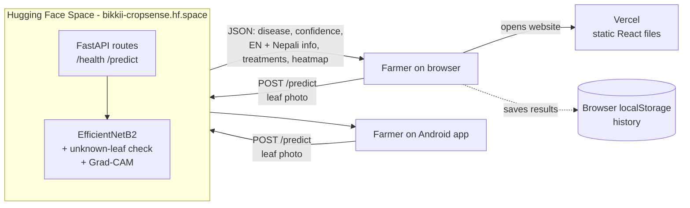
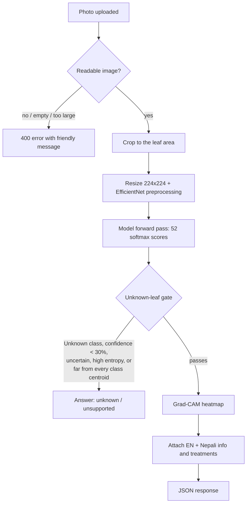

# CropSense AI — Deployment Guide

How the frontend, backend and model are deployed, why each choice was made,
and what to say about it in the defense.

---

## 1. The big picture

CropSense AI has three parts. All three are hosted on **free tiers that need no
credit card**.

| Part | What it is | Where it runs | Live address |
|---|---|---|---|
| **Frontend** (website) | React 19 + Vite single-page app | **Vercel** | Your Vercel project URL (auto-deploys on push to `main`) |
| **Backend** (API) | FastAPI (Python) | **Hugging Face Space** (Gradio SDK, ZeroGPU hardware) | `https://bikkii-cropsense.hf.space` |
| **Model** | EfficientNetB2, 52 classes, TensorFlow/Keras | Inside the backend, on the same Space | — |
| **Database** | PostgreSQL 18 — accounts + prediction history | **Neon** serverless, free tier, Singapore | via the `DATABASE_URL` secret |
| **Mobile app** | Expo / React Native (SDK 57) | Installed on the phone as an APK | Calls the same backend |



**Key idea:** Vercel only serves the website's files (HTML, CSS, JavaScript).
It does **not** run the model. The website runs in the farmer's browser, and
the browser sends the photo **directly** to the Hugging Face backend.

---

## 2. Backend + model — Hugging Face Space

### 2.1 Why Hugging Face?

The model needs about **700 MB – 1.1 GB of RAM** (TensorFlow + an 8.5 M-parameter
network), measured in a container. That rules out most free hosts:

| Option | Free without card? | Problem |
|---|---|---|
| Render / Koyeb free tier | Yes | Only 512 MB RAM, so TensorFlow runs out of memory |
| Google Cloud Run, AWS, Oracle Cloud | No | Need a credit card for billing |
| Hugging Face **Docker** Space / CPU Basic | No | Now a paid (PRO) feature |
| **Hugging Face Gradio Space on ZeroGPU** | **Yes** | **Chosen.** Enough memory, free, public HTTPS URL |

### 2.2 How it works on ZeroGPU

- A free account can only create **Gradio-SDK** Spaces on **ZeroGPU** hardware.
- The model runs on the **CPU**. ZeroGPU's GPUs are only given to functions
  marked `@spaces.GPU`, and TensorFlow doesn't use them. That's fine: this model
  is small enough for CPU.
- ZeroGPU refuses to start unless at least one `@spaces.GPU` function exists,
  so `app.py` defines an empty placeholder one.
- The Space must start through **Gradio's own `launch()`**, which is how ZeroGPU
  knows the app is up. The first attempt started a separate `uvicorn` server,
  which failed with `address already in use` on port 7860. The fix was to use
  `gr.Server` (a FastAPI app with Gradio's launcher) and copy the backend's
  routes onto it.

### 2.3 Where the files live

The Space is its **own git repository**, separate from GitHub:

- Local folder: `~/Documents/cropsense-space`
- Remote: `https://huggingface.co/spaces/Bikkii/CropSense`

| File | Purpose |
|---|---|
| `app.py` | Entry point: imports `spaces`, adds the ZeroGPU placeholder, copies routes from `main.py` onto `gr.Server`, adds CORS, launches on port 7860 |
| `main.py` | The FastAPI backend (identical to `backend/main.py`) |
| `auth.py`, `db.py` | Login/database code (turned off; see 2.6) |
| `requirements.txt` | Python packages: `tensorflow==2.21.0`, `numpy==2.2.6`, `opencv-python-headless`, `pillow`, `python-multipart`, `spaces`, … |
| `README.md` | Space settings in its header: `sdk: gradio`, `sdk_version: 6.27.0`, `python_version: "3.10"`, `app_file: app.py` |
| `class_names.json` | The 52 class names |
| `disease_info.json` | Symptoms, cause, management, prevention in English + Nepali |
| `treatments.json` | Treatment protocols with doses in English + Nepali |
| `last_final_model/best_model_phase2.weights.h5` | Model weights (~102 MB), stored with **Git LFS** |
| `last_final_model/ood_stats.npz` | Class centroids + threshold for the unknown-leaf check, stored with Git LFS |

**Why Git LFS?** Normal git handles large binary files poorly, and Hugging Face
rejects plain git files over 10 MB. LFS keeps a small pointer in git and stores
the real file separately.

**Why aren't the weights on GitHub?** They're gitignored in the main repo. GitHub
is for code; the Space holds the deployable backend + model.

### 2.4 What happens on the Space when it starts

1. Hugging Face reads `README.md`, installs `requirements.txt` on Python 3.10, and runs `app.py`.
2. `main.py` rebuilds the EfficientNetB2 architecture and loads `best_model_phase2.weights.h5`.
3. It loads `ood_stats.npz`: 51 centroids, threshold **0.5596**, layer `dense_hidden`.
4. The server listens on port **7860**, and Hugging Face exposes it as
   `https://bikkii-cropsense.hf.space` with HTTPS.

Harmless warnings you'll see in the logs:
- `CUDA ... no CUDA-capable device`: expected, because it runs on CPU.
- `database unavailable`: login/history are turned off, and `/predict` doesn't need a database.
- `JWT_SECRET is not set`: only used by the (turned-off) login feature.

### 2.5 API endpoints

| Method | Path | What it does |
|---|---|---|
| GET | `/health` | Returns `{"status":"healthy","model_loaded":true,"number_of_classes":52,...}` |
| POST | `/predict` | Form fields: `file` (image) and optional `crop_type`. Returns the diagnosis JSON |
| GET | `/docs` | Interactive API docs (Swagger) |

**What `/predict` does, step by step:**



### 2.6 Security and design decisions

- **CORS is open (`*`):** the website (on Vercel's domain) and the mobile app must
  be able to call the API from another origin. There are no user accounts or
  private data, so this is safe.
- **Accounts are required:** both clients enforce sign-in, so every check is saved
  to the right user. The backend still answers an unauthenticated `/predict` on
  purpose — an expired token must never fail a diagnosis mid-request.
- **Database:** a free **Neon** serverless PostgreSQL, reached over SSL with the
  `DATABASE_URL` secret. It sleeps when idle and wakes on the next connection.
- **Secrets on the Space** (Settings → Variables and secrets): `DATABASE_URL` and
  `JWT_SECRET`, neither committed to git. Without `JWT_SECRET` the server signs
  tokens with a random key, so every restart logs users out.
- **A real bug to remember:** psycopg2 must be imported **before** TensorFlow. Both
  bundle their own OpenSSL, and with TensorFlow first every TLS connection to the
  database segfaults the process (exit 139, no traceback).
- **Input safety:** empty files and non-images are rejected with a 400 error and
  a plain-language message instead of crashing. Known weakness: the
  decompression-bomb guard is weaker than intended — Pillow only raises above
  twice `MAX_IMAGE_PIXELS`, so a 132 MP image is decoded (it still returns a safe
  *Not a Leaf*). The fix is an explicit dimension check returning 400.
- **Photos are never stored:** the uploaded image is processed in memory and
  discarded. What is saved for a signed-in user is the result — disease,
  confidence, guidance text, a 160 px thumbnail and the Grad-CAM image.

### 2.7 Performance

| | Laptop | Live Space (shared free CPU) |
|---|---|---|
| One prediction, measured | **0.79 s** average sequential | **6.75 s** average when warm |
| Three clients at once | 2.18 s median (p90 3.26 s) | — |
| Memory | ~700 MB | same |

Most of the time goes to **Grad-CAM** (about 87% of compute). The model's own
forward pass is only ~50 ms on a fast CPU.

**Sleeping:** a free Space goes to sleep when nobody uses it for a while, and the
next request takes longer while it wakes up.
**Before a demo, open `https://bikkii-cropsense.hf.space/health` a few minutes early.**

### 2.8 How to update the backend or model

```bash
# 1. copy the changed file(s) from the main project, e.g.
cp ~/Documents/CropSense/backend/main.py ~/Documents/cropsense-space/
# 2. commit and push
cd ~/Documents/cropsense-space
git add -A && git commit -m "Update backend"
git push origin main        # username: Bikkii, password: a Hugging Face WRITE token
```

The Space rebuilds automatically, which takes a few minutes.

---

## 3. Frontend — Vercel

### 3.1 Why Vercel?

- Free with no card, and made for React/Vite static sites.
- Connected to GitHub: **every `git push` to `main` redeploys automatically**.
- Global CDN and HTTPS included.

### 3.2 Settings used

| Setting | Value |
|---|---|
| Repository | `github.com/Bibekshah123/AI-based-Crop-Disease-Detection` |
| Branch | `main` |
| Root Directory | `frontend` |
| Framework preset | Vite |
| Build command | `npm run build` (runs `vite build`) |
| Output directory | `dist` |
| Environment variable | `VITE_API_BASE_URL` = `https://bikkii-cropsense.hf.space` |

### 3.3 How the build works

1. Vercel clones the repo and goes into `frontend/`.
2. `npm install`, then `vite build` turns the React code into plain HTML/CSS/JS files in `dist/`.
3. **`VITE_API_BASE_URL` is baked into the JavaScript at build time.** If you change
   it, you must **redeploy**; editing the variable alone does nothing.
4. `frontend/src/lib/api.js` reads that value; every API call goes through this one file.
5. Vercel serves `dist/` from its CDN.

### 3.4 `vercel.json`: why it's needed

```json
{ "rewrites": [{ "source": "/(.*)", "destination": "/index.html" }] }
```

The site is a **single-page app**: pages like `/history` and `/about` exist only
in JavaScript (React Router), not as real files. Without this rule, refreshing
`/history` would give a 404. The rule sends every path to `index.html`, and React
then shows the right page. (`frontend/public/_redirects` does the same job if the
site is ever hosted on Netlify.)

### 3.5 Where history is stored

There's no login, so history is saved **in the browser's localStorage** on that device:
- Up to 100 results; if storage fills up, it keeps the newest 50.
- Stays on that browser only. It is **not** shared between devices, and clearing
  browser data removes it.
- "Delete all" on the History page clears it.
- The full API response is stored, so switching English ⇄ Nepali updates old results too.

### 3.6 How to update the frontend

```bash
cd ~/Documents/CropSense
git add -A && git commit -m "Update frontend"
git push origin main       # Vercel redeploys automatically
```

### 3.7 Problem hit during deployment (a good defense story)

The first Vercel build failed with `Could not resolve '../lib/strings'` and 16 similar errors.
**Cause:** the root `.gitignore` had a Python template rule `lib/`, which also
matched `frontend/src/lib/`. Those 11 files built fine locally but were never
committed. **Fix:** changed the rule to `/lib/` (top level only), committed the
folder, and verified a **fresh clone** builds and passes all 24 tests.
**Lesson:** "works on my machine" isn't enough; test from a clean clone.

---

## 4. Mobile app — APK (built and installed)

- The backend address is in `mobile/config.js`:
  `process.env.EXPO_PUBLIC_API_URL ?? "https://bikkii-cropsense.hf.space"`
- The live URL is the **default in code** because EAS cloud builds skip
  gitignored files like `.env.local`.
- Build a standalone APK (free Expo account, no card):
  ```bash
  cd ~/Documents/CropSense/mobile
  npx eas-cli login
  npx eas-cli build -p android --profile preview    # → downloadable .apk
  ```
  The first run creates the EAS project (adds `extra.eas.projectId` to
  `app.json`) and generates the Android **keystore**, which Expo stores. Keep
  access to that Expo account: future versions must be signed with the same key.
- The build runs on Expo's servers (10–30 min on the free plan) and prints a
  download link and QR code. **Download links expire**, so keep a copy of the
  `.apk` (one is saved at `~/Documents/CropSense/cropsense-ai.apk`, gitignored
  because it is ~66 MB).
- The APK installs directly on Android; it needs no Expo Go and no laptop.
  Android asks to allow "install from unknown sources" the first time.
- The app icon, adaptive icon and splash screen are generated from the web app's
  leaf mark (`mobile/assets/`). Crop selection is **optional** and defaults to
  "Any crop".
- The app waits up to 40 s for a prediction; the website waits up to 60 s.
- To rebuild after code changes: commit first (EAS uploads the committed git
  state), then run the same build command.

---

## 5. End-to-end flow of one diagnosis (live)

1. The farmer opens the Vercel link. The browser downloads the React app from Vercel's CDN.
2. They pick a crop (optional), add a leaf photo and tap **Analyze leaf**; the scanning animation starts.
3. The browser sends `POST https://bikkii-cropsense.hf.space/predict` with the photo.
4. The Space checks the image, crops to the leaf, runs EfficientNetB2, applies the
   unknown-leaf check, makes the Grad-CAM heatmap, and attaches EN + Nepali info and treatments.
5. The JSON comes back (~10 s). The website shows the result in the chosen language
   and saves it to localStorage history.

---

## 6. Free-tier limitations (be honest about these)

| Limitation | Impact | How it could be solved with budget |
|---|---|---|
| Shared CPU on the free Space | ~10 s per prediction | Paid CPU/GPU Space, or skip Grad-CAM unless requested |
| Space sleeps when idle | First request after idle is slow | Paid always-on hardware, or a scheduled health ping |
| No database | History is per-browser, not per-user | Add Postgres (the code for auth/history already exists, turned off) |
| Needs internet | Won't work in fields with no signal | Convert the model to **TFLite** and run it on the phone (future work) |
| Depends on free-tier policies | Hugging Face already moved Docker Spaces to paid | The backend is portable: the same code runs in Docker anywhere |

**Backup plan for defense day:** the full stack also runs locally with
`docker compose up -d --build` (backend, frontend, database). If the internet
fails, demo from the laptop. Keep the built APK (`cropsense-ai.apk`) on the
laptop too — Expo download links expire.

---

## 7. Likely defense questions on deployment

**Q: Where is your model deployed and why there?**
On a Hugging Face Space (Gradio SDK, ZeroGPU hardware), because it's free with no
card and has enough RAM for TensorFlow. Render/Koyeb free tiers have only 512 MB,
and cloud providers need a card.

**Q: Your model runs on "ZeroGPU", so does it use a GPU?**
No. It runs on CPU. ZeroGPU only lends GPUs to functions marked `@spaces.GPU`, and
TensorFlow doesn't use them. EfficientNetB2 is small enough (8.5 M parameters) that
CPU is fine; the forward pass is ~50 ms and Grad-CAM takes most of the time.

**Q: Why is the frontend on a different platform from the backend?**
Separation of concerns. The frontend is static files, and Vercel serves those
fast from a CDN for free. The backend needs Python, TensorFlow and RAM. Each can
be updated and scaled separately, and both the website and mobile app share one API.

**Q: How does the frontend know where the backend is?**
Through the environment variable `VITE_API_BASE_URL`, which Vite bakes into the
JavaScript at build time. All requests go through `src/lib/api.js`. The mobile app
uses `EXPO_PUBLIC_API_URL`, with the Space URL as the default.

**Q: What is CORS and why did you enable it?**
Browsers block a page from calling an API on another domain unless the API allows
it. The site is on `vercel.app` and the API is on `hf.space`, so the API sends
`Access-Control-Allow-Origin`. It is currently open to every origin; now that
accounts exist it should be narrowed to the Vercel domain before any real
deployment. Tokens travel in the `Authorization` header, not cookies, so an open
CORS policy does not by itself expose a session.

**Q: How are the large model weights deployed?**
With Git LFS in the Space repository (~102 MB weights plus `ood_stats.npz`).
They're kept out of GitHub, which holds only code.

**Q: What happens if someone uploads a random image or a non-leaf?**
The backend rejects non-images with a 400 error. For real images, the unknown-leaf
gate (Unknown class, low confidence, small margin, high entropy, or distance from
all class centroids above the 0.5596 threshold) returns "unknown" instead of
guessing a disease.

**Q: How does history work without login?**
It's stored in the browser's localStorage on that device, up to 100 results, and
nothing is stored on the server. That protects privacy and needs no database; the
trade-off is that it isn't synced between devices.

**Q: How do you deploy an update?**
Frontend: `git push` to GitHub, and Vercel rebuilds automatically. Backend/model:
push to the Hugging Face Space repo, and it rebuilds automatically.

**Q: Why is the live version slower than local?**
The free Space uses a shared, slower CPU (~10 s vs ~2 s locally), and it sleeps
when idle. Paid hardware or on-device inference would fix this.

**Q: Is it production-ready?**
It's a working public prototype. For production I'd add paid always-on hosting,
monitoring, rate limiting, a database for optional accounts, and an offline
TFLite version for areas without internet.

**Q: What deployment problems did you face?**
(1) Hugging Face Docker Spaces became paid, so I moved to the free Gradio SDK on ZeroGPU.
(2) The first start failed with "address already in use", so I switched to starting
through Gradio's own launcher (`gr.Server`).
(3) The Vercel build failed because `.gitignore` hid `frontend/src/lib/`; I fixed the
rule and verified with a fresh clone.

---

## 8. Quick reference

| Item | Value |
|---|---|
| Backend URL | `https://bikkii-cropsense.hf.space` |
| Health check | `https://bikkii-cropsense.hf.space/health` |
| API docs | `https://bikkii-cropsense.hf.space/docs` |
| Space repo | `https://huggingface.co/spaces/Bikkii/CropSense` (local: `~/Documents/cropsense-space`) |
| GitHub repo | `https://github.com/Bibekshah123/AI-based-Crop-Disease-Detection` |
| Frontend host | Vercel, root `frontend`, env `VITE_API_BASE_URL` |
| Model | EfficientNetB2, 52 classes, `last_final_model/best_model_phase2.weights.h5` |
| Unknown-leaf threshold | 0.5596 (cosine distance on `dense_hidden`) |
| Mobile API setting | `mobile/config.js` → `EXPO_PUBLIC_API_URL` |
| Local backup | `docker compose up -d --build` (always `--build`, or you serve a stale image) |
| Android APK | `~/Documents/CropSense/cropsense-ai.apk` |
